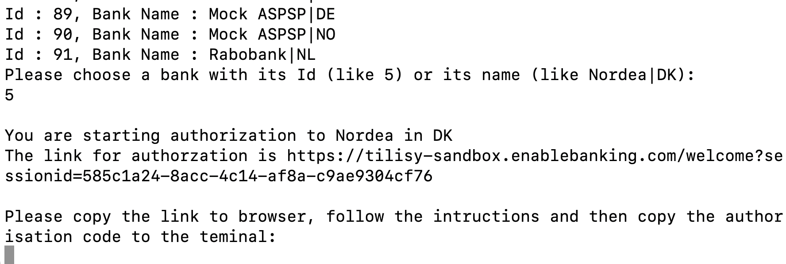
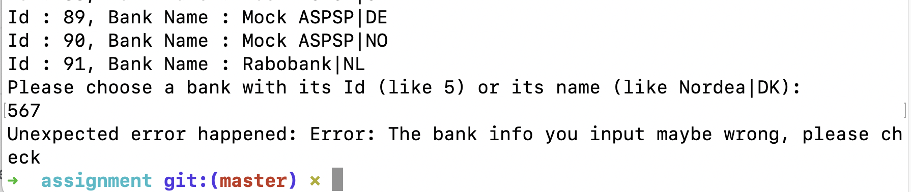

# Intructions to Run the Application

## 1. Setup

Make sure Node.js has been installed

## 2. Configuration 

To use run the program, you need an application that has been registered on the Enable Banking Control Panel. 

**If you would like to use the application I have registered**, please copy the key I have sent to the `assignment` folder. Then go to step 3.

**If you would like to use your own application**. First sign up for the Enable Banking Control Panel (simply go to https://enablebanking.com/sign-in/ and enter your email where you would get a one time authentication link) and register a new application (when signed in, go to https://enablebanking.com/cp/applications and fill in the app registration form). After registered the application, you should get a private key and see a page similar to follows:

Now, open the file `config.json`, replace the `keyPath`, `applicationId`, and `redirectUrl` field according to the information you have obtained. After that, put the private key you got to the `assignment` folder.

## 3. Run the program

1. Enter the folder `assignment`, run the command `npm install` under the folder to set the running environment. The folder should contain following files, please check if there is any missing file.

   - `The key` (a file with suffix `.pem`)
   - `main.js` (The main file of the application)
   - `package.json` (Configuration)
   - `service.js` (Services to support the `main.js`)
   - `utils.js` (Support `main.js` and `service.js`)

2. Run the application under the folder `assignment` with command `node main.js`

3. A list of banks will be shown as follows, choose one with its name or id.

   

   Note, you should type the ids and names listed on the terminal, anything else is unacceptable. For example to choose the Nordea bank in Denmark. You should type `5` or `Nordea|DK`. For example (with id):

   

   Or (with name)

   

   If you see an error as follows, or the link for authorization is not presented,

   

   it should be something wrong with the bank info you typed, please check that.

4. After choosing the bank, you will be given a link for authentication. Paste it to the web browser, complete the authentication and authorise access to the bank data.

   

   In this step, you should click the green button.

5. After finish the authentication, copy the code in the redirect url back to the terminal. If the url is`https://enablebanking.com/auth_redirect?state=some_test_state&code=de8ae2bf-c261-4b51-a35b-ed995a64189f`, the code should be `de8ae2bf-c261-4b51-a35b-ed995a64189f`, like this:

   

   If you see error as follows, may be the code you typed is wrong, please check that.

   

6. After coping the url back to the terminal, you should be able to see a short summary of the transactions for the last 30 days for each account associated with the session. As follows:

   

   

   

   