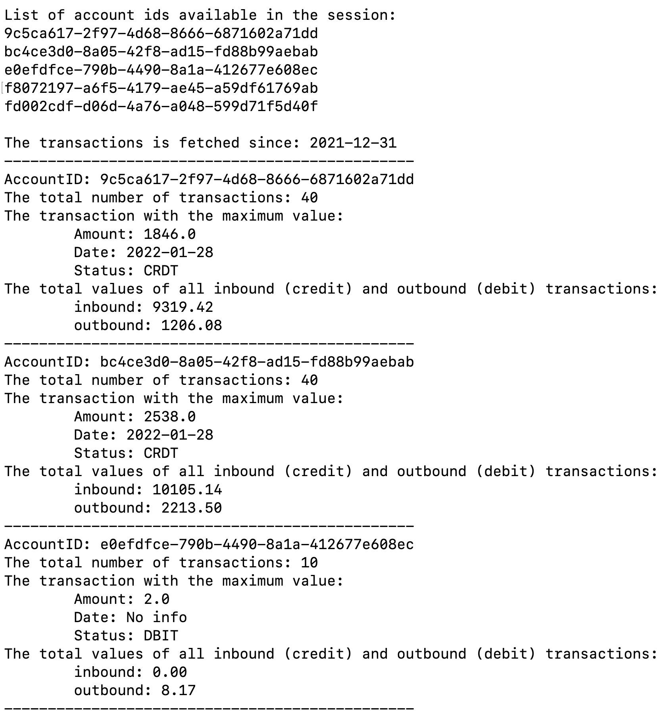

# Intructions to Run the Application

1. Make sure Node.js has been installed

2. Enter the folder `assignment`, run the command `npm install` under the folder to set the running environment. The folder should contain following files, please check if there is any missing file.

   - The key (a file with suffix `.pem`)
   - main.js (The main file of the application)
   - package.json (Configuration)
   - service.js (Services to support the main.js)
   - utils.js (Support main.js and service.js)
   
3. Run the application under the folder `assignment` with command `node main.js`

3. A list of banks will be shown as follows, choose one with its name or id.

   
   
   Note, you should type the id and name listed on the terminal, anything else is unacceptable . For example to choose the Nordea bank in Denmark. You should type `5` or `Nordea-DK`. For example:
   
   
   
   Or
   
   
   
   If you see an error as follows:
   
   
   
   It should be something wrong with the bank info you typed, please check that.
   
5. After choosing the bank, you will be given a link for authentication. Paste it to the web browser, complete the authentication and authorise access to the bank data.

   

   In this step, you should click the green button.

6. After finish the authentication, copy the code in the redirect url back to the terminal. If the url is`https://enablebanking.com/auth_redirect?state=some_test_state&code=de8ae2bf-c261-4b51-a35b-ed995a64189f`, the code should be `de8ae2bf-c261-4b51-a35b-ed995a64189f`

   If you see error as the following picture, may be the code you typed is wrong, please check that.

   

7. After coping the url back to the terminal, you should be able to see a short summary of the transactions for the last 30 days for each account associated with the user’s bank account. As follows:

   

   

   